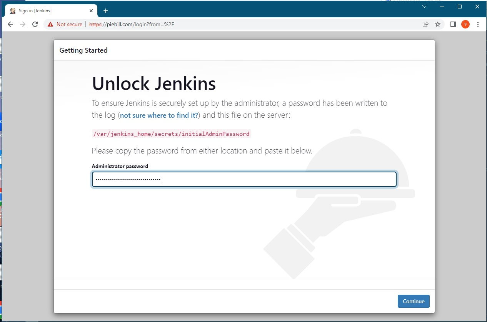

# Setting up Jenkins in Docker with SSL/HTTPS
---


#### 1. Create t2.small, Ubuntu 22.04 AWS EC2 Instance and Allow 80, 443 in Security Groups Inbound Traffic Rules

#### 2. Run below commands to update keytool command
```
sudo apt update && sudo apt upgrade && sudo apt install openjdk-11-jdk
```
#### 3. Run below command to install docker and "docker compose" software:
```
chmod 755 ec2software.sh
./ec2software.sh
```
#### 4. Run below to generate jenkins_keystore.jks file
```
keytool -genkey -keyalg RSA -alias selfsigned -keystore jenkins_keystore.jks -storepass mypassword -keysize 4096
```
#### 5. Run below to start Jenkins Server on port 443
```
docker run -v ./jenkins_home:/var/jenkins_home -p 443:8443 jenkins/jenkins:latest --httpPort=-1 --httpsPort=8443 --httpsKeyStore=/var/jenkins_home/jenkins_keystore.jks --httpsKeyStorePassword=mypassword
```
#### 6. Run below command to get the IP Address of EC2:
```
wget -qO- http://instance-data/latest/meta-data/public-ipv4; echo
```
#### 9. Open browser at URL: https://ip-address:443

#### 10. Ouput for reference:
```
ubuntu@ip-172-31-20-205:~/jenkssldckr$ keytool -genkey -keyalg RSA -alias selfsigned -keystore jenkins_keystore.jks -storepass mypassword -keysize 4096
What is your first and last name?
  [Unknown]:  piebill
What is the name of your organizational unit?
  [Unknown]:  piebill
What is the name of your organization?
  [Unknown]:  piebill
What is the name of your City or Locality?
  [Unknown]:  california
What is the name of your State or Province?
  [Unknown]:  ca
What is the two-letter country code for this unit?
  [Unknown]:  us
Is CN=piebill, OU=piebill, O=piebill, L=california, ST=ca, C=us correct?
  [no]:  yes

ubuntu@ip-172-31-20-205:~/jenkssldckr$
```




---
### Notes :
---

**Setting up bash script for alias commands** 

ubuntu:~$ cat shcut.sh

```
alias cls='clear'
alias scn='screen'
alias gitusr='git config --global user.name "Srikanth Pen"'
alias giteml='git config --global user.email "wrkbase@gmail.com"'
alias gitlst='git config --list --global'
alias gtcl='git clone https://bitbucket.org/wrkbase/dockertraefikselfsign.git --branch master'
alias frgrp='for i in `find src -name "*.js"`; do echo $i ===========================; grep "createUser" $i; done'
alias frdif='for i in `find . -name "*.ORG"`; do echo $i =====================================; fl=`echo $i | sed 's/.ORG$//'`; diff --color $i $fl; done'
alias diffc='diff --color'
alias gits='git status'
alias gitns='git log --name-status'
alias gitdc='git log --graph --all --decorate --pretty="%Cred%h%Creset -%C(auto)%d%Creset %s %Cgreen(%ad) %C(bold blue)<%an>%Creset" --date=short'
alias gitcomm='git status; git checkout -b master; git add . ; git commit -m "Traefik HTTPS Trusted Web Secure Certificates in Docker"; git push -u origin master; git status;'
alias gitfrc='git push -f -u origin master'
```

---
